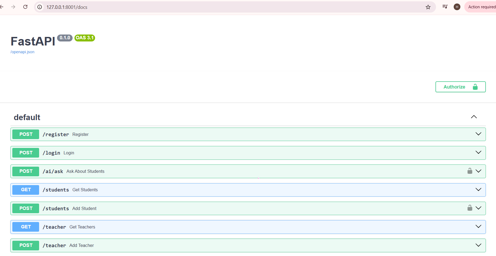
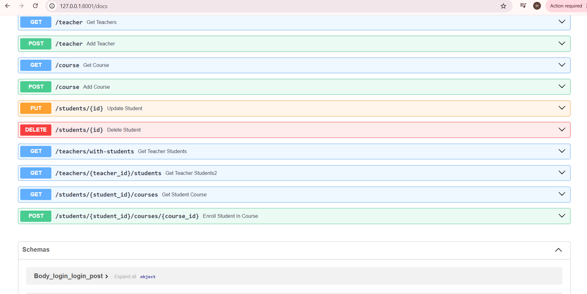

Student Management System API:
A RESTful API built with FastAPI for managing students, teachers, courses, and user authentication. The project demonstrates modern backend development practices such as JWT authentication, SQLAlchemy ORM, PostgreSQL, Alembic migrations, Docker containerization, RESTful API design, and AI API integration for intelligent backend features.

 Features:
- JWT Authentication
- RESTful CRUD APIs
- Database Relationships
- Input & Response Validation using Pydantic
- SQLAlchemy ORM
- Alembic Database Migrations
- Automated API Testing
- Dockerized Application
- Interactive Swagger Documentation
- AI Integration using Google Gemini API for answering natural language questions based on student data.

Tech Stack:
- Python
- FastAPI
- SQLAlchemy
- PostgreSQL
- Alembic
- Pydantic
- Passlib (bcrypt)
- Python-Jose (JWT)
- Docker
- Docker Compose
- Uvicorn
- Pytest
- Google Gemini API

Project Structure:
.
├── alembic/
├── main.py
├── models.py
├── database.py
├── Dockerfile
├── docker-compose.yml
├── requirements.txt
├── .env.example
└── README.md
└── images
    └── swagger.png
    └── swagger2.png

Requirements:
Python 3.12+
PostgreSQL
Docker & Docker Compose (Optional)

 Installation:
 - Clone the repository
 git clone https://github.com/Hageerahmed/Student-Management-System-API
 cd Student-Management-System-API
- Create and activate a virtual environment
 python -m venv venv
 venv\Scripts\activate
- Install dependencies:
 pip install -r requirements.txt

Environment Variables:
Create a `.env` file based on `.env.example`.

Database Migration:
Create a new migration:
alembic revision --autogenerate -m "Initial Migration"
Apply migrations:
alembic upgrade head

1- Run the Application
uvicorn main:app --reload

2- Run with Docker:
- Build and start all services
docker compose up --build
- Apply database migrations
docker compose exec app alembic upgrade head
#This will create or update the database schema before using the API

Running Tests:
pytest

Authentication:
The API uses JWT Bearer Authentication
- Register a new user.
- Login to receive an access token.
- Include the access token in the Authorization header: You can authenticate directly from Swagger UI using the Authorize button or use Postman to send the Bearer token with protected requests.
You can now access protected endpoints.

Database Relationships
Teacher → Students (One-to-Many)
Student → Profile (One-to-One)
Students ↔ Courses (Many-to-Many)

API Documentation:
After running the project, Swagger documentation is available at:
http://localhost:8000/docs

Future Improvements:
- Pagination & Filtering
- Implement CI/CD pipeline
- Add Role-Based Authorization (RBAC)
- Deployment on Render/Railway/Koyeb

API Preview

